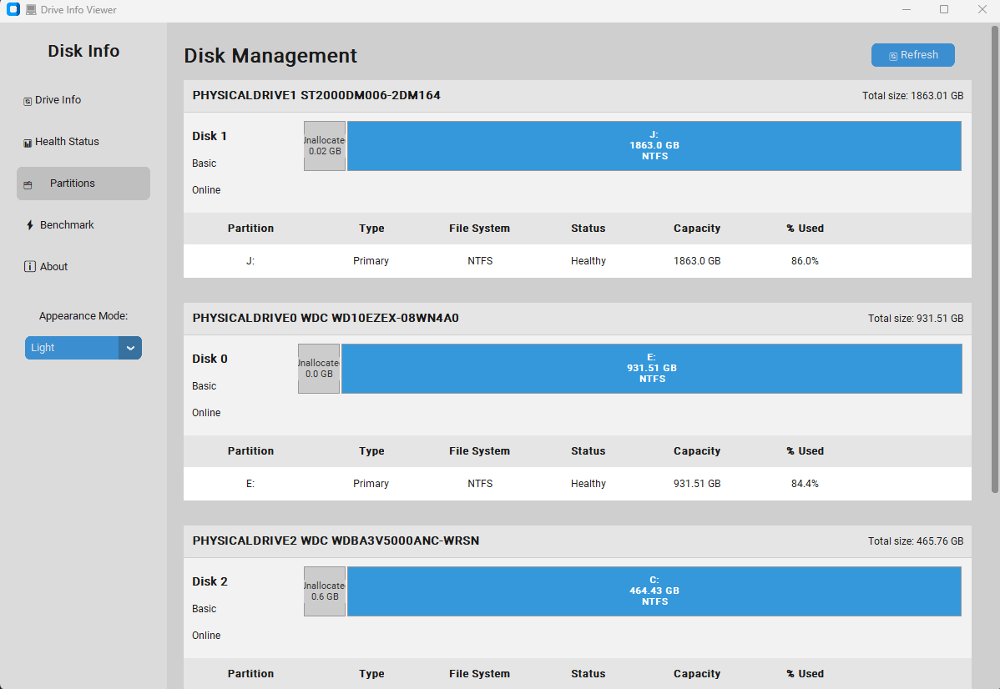

# DiskInfo

DiskInfo is a comprehensive disk management and monitoring tool that provides detailed information about your storage devices. It helps you monitor disk health, performance, and usage, and includes features like benchmarking and partition management.

---

## Table of Contents
- [Features](#features)
- [Installation](#installation)
- [Usage](#usage)
- [Screenshots](#screenshots)
- [Changelog](#changelog)
- [Creator](#creator)
- [Contributing](#contributing)
- [License](#license)
- [Troubleshooting](#troubleshooting)
- [Advanced Usage](#advanced-usage)
- [Roadmap](#roadmap)
- [Acknowledgments](#acknowledgments)

---

## Features

- **Drive Info**: View basic information about all connected drives, including capacity and usage.
- **Health Status**: Monitor drive health using SMART data and predict potential failures.
- **Partitions**: Examine detailed partition information in a Windows Disk Management-style interface.
- **Benchmark**: Test drive read and write speeds with a built-in benchmarking tool.
- **Dark Mode**: Switch between light and dark themes for better usability.

---

## Screenshots

### Drive Information


### Drive Health Status


### Disk Management


### Disk Benchmark


---

## Installation

### Prerequisites
- Python 3.10 or higher
- Required Python libraries:
  - `customtkinter`
  - `psutil`
  - `win32com.client`
  - `Pillow`

### Steps
1. Clone the repository:
   ```bash
   git clone https://github.com/Trukitro/DiskInfo.git
   cd DiskInfo
   ```

2. Create and activate a virtual environment (optional but recommended):
- **On Windows:**
   ```
   python -m venv venv
   venv\Scripts\activate
   ```
- **On macOS/Linux:**
   ```
   python3 -m venv venv
   source venv/bin/activate
   ```
3. Install the required dependencies:
   ```
   pip install -r requirements.txt
   ```
4. Run the application:
   ```
   python DiskInfov5.py
   ```
5. (Optional) Build the .exe file:
- **If you want to create a standalone executable file, use PyInstaller:**
   ```
   pip install pyinstaller
   pyinstaller --onefile DiskInfov5.py
   ```
- **The .exe file will be located in the dist folder.**


---

## Executable Version

### Overview
The `.exe` version of DiskInfo allows you to run the application without needing to install Python or any dependencies. It is a standalone executable file that simplifies usage for non-technical users.

### Benefits
- **No Dependencies**: No need to install Python or additional libraries.
- **Portable**: Can be run directly on any Windows machine.
- **Easy to Share**: Distribute the `.exe` file to others without requiring them to set up a Python environment.

### How to Use
1. **Download**:
   - Go to the [Releases](https://github.com/Trukitro/DiskInfo/releases) section of the GitHub repository.
   - Download the latest `.exe` file (e.g., `DiskInfo.exe`).

2. **Run**:
   - Double-click the `.exe` file to launch the application.

3. **Bypass Windows SmartScreen Warning**:
   If you see the "Windows protected your PC" warning:
   - Click **More Info**.
   - Click **Run Anyway** to proceed.

4. **Explore Features**:
   - Use the navigation sidebar to access the following features:
     - **Drive Info**: Displays basic information about connected drives.
     - **Health Status**: Monitors the health of your drives.
     - **Partitions**: Provides detailed partition information.
     - **Benchmark**: Tests the read/write speeds of your drives.

### Notes
- The `.exe` file is built using **PyInstaller**, which packages the Python application into a standalone executable.
- Ensure you have the necessary permissions to run the file on your system.
- If you encounter any issues, refer to the [Troubleshooting](#troubleshooting) section.

### Example
Here’s how the `.exe` file might look when running on a Windows system:

```plaintext
C:\Users\YourUsername\Downloads> DiskInfo.exe
```

---

## Troubleshooting

### Common Issues

1. **Missing Dependencies**:
   - If you encounter an error about missing libraries, ensure you have installed all required dependencies:
     ```bash
     pip install -r requirements.txt

     ```
2. **Windows SmartScreen Warning**:
   - If you see the "Windows protected your PC" warning when running the `.exe` file:
     1. Click **More Info**.
     2. Click **Run Anyway** to proceed.
   - This warning appears because the `.exe` file is not signed with a trusted code signing certificate. It is safe to run if you downloaded it from the official [Releases](https://github.com/Trukitro/DiskInfo/releases) page.


3. **Permission Denied Errors**:
   - Run the application as an administrator if you encounter permission issues accessing certain drives.

4. **SMART Data Not Available**:
   - Some drives may not support SMART data. Check your drive's specifications.

5. **Benchmark Errors**:
   - Ensure the drive is writable and has sufficient free space for the benchmark test.

If you encounter other issues, feel free to open an issue on the [GitHub repository](https://github.com/Trukitro/DiskInfo/issues).

---

## Advanced Usage

### Debug Mode
Run the application in debug mode to see detailed logs:
```bash
python DiskInfov5.py --debug
```

---

## Roadmap

Here are some planned features and improvements for future releases:

- Add support for monitoring network drives.
- Export drive and partition information to CSV or JSON files.
- Provide detailed SMART data reports for advanced users.
- Add a notification system for drive health warnings.
- Include multi-language support for international users.

Feel free to suggest additional features by opening an issue on the [GitHub repository](https://github.com/Trukitro/DiskInfo/issues).

---

## Acknowledgments

- [CustomTkinter](https://github.com/TomSchimansky/CustomTkinter) for the modern UI framework.
- [Psutil](https://github.com/giampaolo/psutil) for system and disk information.
- [Pillow](https://python-pillow.org/) for image handling.
- The Python community for their support and contributions.

---

## License

This project is licensed under the MIT License. See the [LICENSE](LICENSE) file for details.